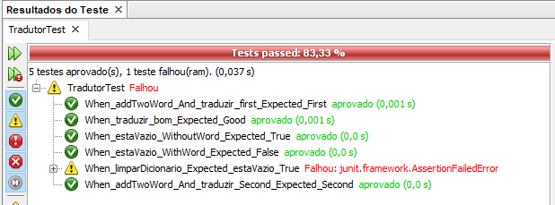

# TDD

### Exibição
Usando [Guia de nomeclatura][naming-conventions] escrito por Oleksandr Stefanovskyi permite uma leitura mais legível dos testes, segue imagem:

[naming-conventions]: https://medium.com/@stefanovskyi/unit-test-naming-conventions-dd9208eadbea
